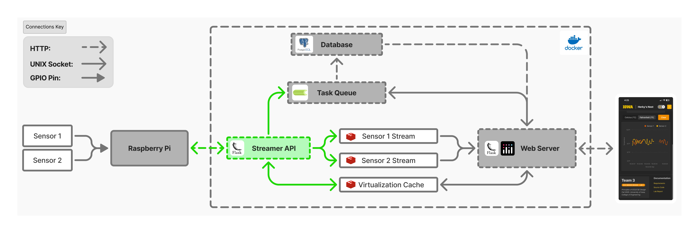

# L1-EXTENSION-stream-writer
Flask server to receive and stream physical temperature readings to web server. Designed to decouple dashboard web application and physical embedded system. 

  
  
<em>System Architecture</em>

## Responsibilities
**1. Receive Temperature Readings from Embedded System:**
- provides simple APIs for receiving readings 

**2. Virtualize Physical Embedded System Buttons:"**
- performs virtualization logic to update the physical display

**3. Detect Critical Temperatures:"**
- compares cached user minimum and maximum thresholds to readings to determine if critical temperature reached
- places task to send email in celery task queue

## Key Libraries/Services
**[Redis Stream](https://redis.io/docs/latest/develop/data-types/streams/)**: 
- timestamped streams

**[Redis Cache](https://redis.io/docs/latest/develop/data-types/)**: 
- dashboard to embedded system virtualization